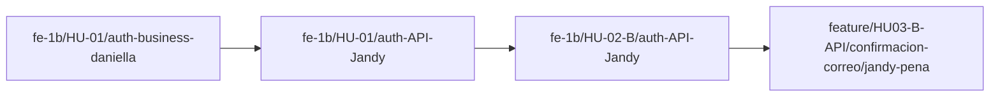

# 📋 Análisis Técnico y Diagnóstico: HU04 — Recuperación de Contraseña

**Proyecto:** Vice City  
**Historia de Usuario:** HU-04 — Recuperación de contraseña  
**Responsable API:** Jandy Peña (`BlurTrace`)  
**Fecha de Análisis:** 10 de Octubre de 2026  
**Conversación Activa:** `6bd57152-3917-475a-b7f5-f61510e316c0`

---

## 1. Estado de las Subtareas de la HU-04

| Subtarea | Responsable | Capa | Rama en GitHub | Estado |
|---|---|---|---|---|
| **HU04-BD** | José Gutiérrez | Base de Datos (ORM Prisma) | `feature/HU04-BD-ORM/prisma-recuperacion/jose-gutierrez` | ✅ **Completada** |
| **HU04-B LN** | Daniela Zapata | Lógica de Negocio (Backend) | `feature/HU04-B-LN/logica-recuperacion/daniela-zapata` | ✅ **Completada** |
| **HU04-B API** | Jandy Peña | Endpoints HTTP / Swagger | `feature/HU04-B-API/recuperacion-contrasena/jandy-pena` | ⏳ **Pendiente (Por iniciar)** |

---

## 2. Detalle de lo Implementado por el Equipo

### A. Subtarea 1: HU04-BD (ORM Prisma - José Gutiérrez)
* **Modelo en Prisma (`prisma/schema.prisma`):**
  * Modelo `verification_tokens` con discriminador `type` (`email_verification` vs `password_reset`), índices compuestos y relación con `users`.
  * Modelo `users` enriquecido con `email_verified` y `email_verified_at`.
* **Capa de Persistencia (`src/features/users/password-reset.repository.ts`):**
  * `createPasswordResetToken()`: Generación segura SHA-256 en BD (token plano de 32 bytes solo en memoria), expiración de 1h e invalidación atómica de tokens previos.
  * `getPasswordResetToken()`: Búsqueda flexible por token plano o hash.
  * `resetPassword()`: Operación atómica (`prisma.$transaction`) con protección estricta contra condiciones de carrera.

### B. Subtarea 2: HU04-B LN (Lógica de Negocio - Daniela Zapata)
* **Servicio Principal (`src/features/auth/services/password-reset.service.ts`):**
  * `requestPasswordReset(email, clientBaseUrl)`: Validación de existencia de usuario, invalidación previa, generación de token y despacho desacoplado por correo.
  * `resetPassword(token, newPassword)`: Validación de longitud (>= 8 caracteres), encriptación con `bcryptjs` (salt = 10) y consumo atómico.
  * `validateTokenStatus(token)`: Consulta de vigencia sin consumir para la UI.
* **Errores de Dominio (`src/features/auth/errors/password-reset.errors.ts`):**
  * `PasswordResetTokenExpiredError` (`TOKEN_EXPIRED`)
  * `InvalidPasswordResetTokenError` (`INVALID_TOKEN`)
  * `UserNotFoundError` (`USER_NOT_FOUND`)
  * `WeakPasswordError` (`WEAK_PASSWORD`)
* **Servicio de Correo (`src/features/auth/services/email.service.ts`):**
  * Interfaz desacoplada `IEmailSender` con implementaciones `ConsoleEmailSender` y `MockEmailSender`.
* **Pruebas:** 6 de 6 pruebas unitarias aprobadas en `tests/unit/password.reset.test.mjs`.

---

## 3. Diagnóstico de Ramas y Divergencia Git

### Linaje de Ramas de Jandy

### Divergencias Detectadas con `backend`
* **Contra `origin/backend` hoy:** De las 20 ramas de backend en GitHub, **19 están limpias**. La única con conflicto directo hoy es `HU03-B-API` por un conflicto `add/add` documental en `.agents/skills/vice-city-architecture/SKILL.md` (bloque `## Dev Stack`).
* **Divergencia cruzada API vs LN/BD:** La rama de Daniela (`HU04-B-LN`) no tiene `zod` en `package.json` ni las rutas previas de API, mientras que tu rama de API (`HU03-B-API`) tiene toda la infraestructura de rutas pero carece de la lógica de HU04.

---

## 4. Plan de Acción para HU04-B API (Jandy Peña)

1. **Crear Rama:** `feature/HU04-B-API/recuperacion-contrasena/jandy-pena` desde `feature/HU04-B-LN/logica-recuperacion/daniela-zapata`.
2. **Endpoints a Implementar:**
   * `POST /api/auth/forgot-password` (solicitar correo de recuperación con token de 1h).
   * `POST /api/auth/reset-password` (restablecer contraseña).
   * `GET /api/auth/reset-password` (validar estado del token para la UI).
3. **Validación:** Schemas Zod estrictos con `.strict()`.
4. **Contrato OpenAPI:** `docs/swagger/auth-password-reset.swagger.json`.
5. **Tests:** `tests/unit/password-reset.route.test.mjs`.
6. **Documentación:** `docs/PULL_REQUEST_HU04_AUTH_RESET_API.md`.
